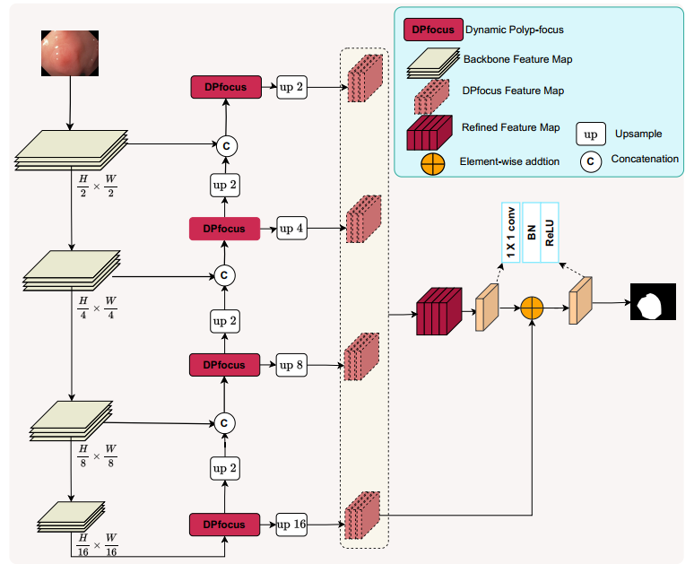
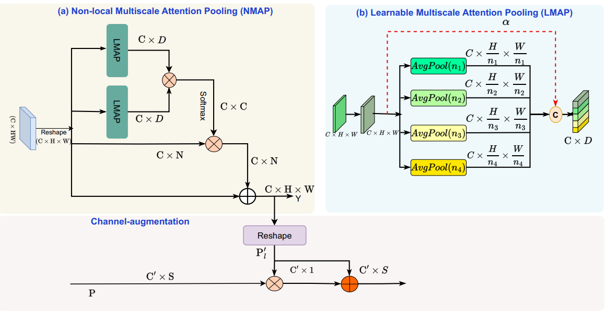
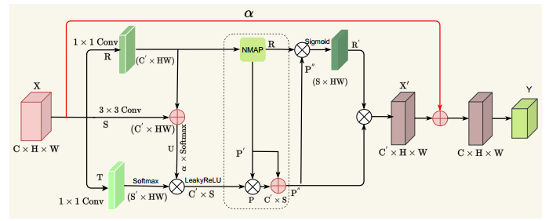

# MDPNet

## DATASETS
1. [CVC-300](https://drive.google.com/file/d/1r_yec8wdYmH1Zf7azoK_iW5eorc_uCMV/view?usp=sharing)

2. [CVC-ClinicDB](https://drive.google.com/file/d/1CEulpZWSyry1Tt5kcH-PPjuJE4ffcSlq/view?usp=sharing)

3. [CVC-ColonB](https://drive.google.com/file/d/1DQtdJUG7ryIGqjJrzqK1cpisNGDr6nex/view?usp=sharing)

4. [Kvasir](https://drive.google.com/file/d/1EtVSlCZksiUQMk7j7FuvhVCY74_5gZxx/view?usp=sharing)
